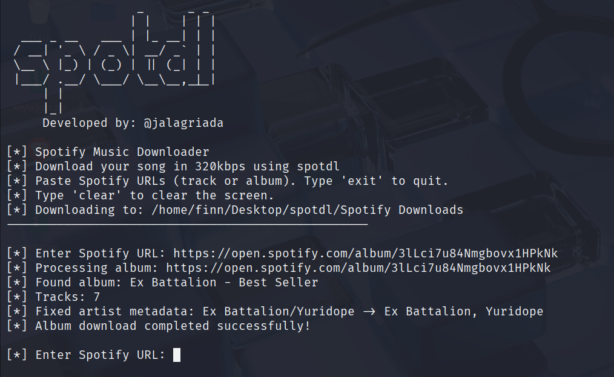

# SpotDL

**SpotDL** is a Python-based Spotify downloader that fetches high-quality (320kbps) MP3 audio from Spotify tracks and albums. It leverages the Spotify API for track information, YouTube for audio search, and `yt-dlp` for downloads. The tool also supports metadata embedding (ID3 tags), including album art, making it ideal for building offline music collections.



---

## Features
- Download individual tracks or entire albums from Spotify.
- Fetch high-quality audio (320kbps MP3).
- Automatically embed metadata and album art.
- Works across Linux, macOS, and Windows.
- Uses YouTube as a source for audio extraction.
- Simple setup with Python virtual environments.

---

## Setup Instructions

Follow the steps below to set up the virtual environment and install the necessary dependencies.

### Prerequisites
- Python 3.x installed
- `pip` package manager available
- Internet connection

---

### Linux & macOS
```bash
# Create virtual environment
python3 -m venv spotify_venv

# Activate virtual environment
source spotify_venv/bin/activate

# Install dependencies
pip install --upgrade pip
pip install spotdl requests
pip install -r requirements.txt
```

---

### Windows
```bat
REM Create virtual environment
python -m venv spotify_venv

REM Activate virtual environment
call spotify_venv\Scripts\activate

REM Install dependencies
python -m pip install --upgrade pip
pip install spotdl requests
pip install -r requirements.txt
```

---

### Optional: One-Click Setup

#### Linux/macOS
```bash
chmod +x setup.sh   # Give execute permission
./setup.sh          # Run the setup script
```

#### Windows
Double-click the batch file (e.g., `setup_spotdl.bat`) to automatically create the virtual environment and install all dependencies.

---

## Usage
Once the virtual environment is set up and activated, you can run SpotDL scripts as needed.

- **Linux/macOS:** Use `python3` to ensure Python 3 is used.  
- **Windows:** Use `python` within the activated environment.  
- Activation commands differ between platforms:
  - Linux/macOS: `source spotify_venv/bin/activate`
  - Windows: `spotify_venv\Scripts\activate`

---

### Notes
- Ensure Python and pip are installed before starting.
- For best results, keep your SpotDL and dependencies updated.
- Metadata embedding requires `ffmpeg` installed and accessible from your system path.
